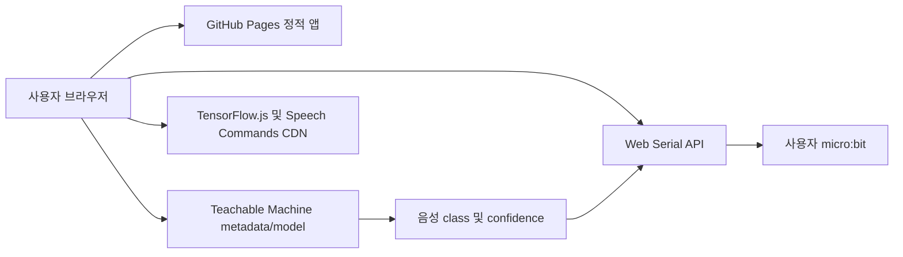

# 마이크로비트 AI 선풍기 프로젝트 분석 및 개선 제안

- 분석일: 2026-07-15
- 분석 기준 커밋: `25bc14e` (`Add confidence setting guidance`)
- 대상 저장소: `WBmaker2/microbit-ai-project1`
- 현재 배포 방식: GitHub Pages 정적 배포

## 1. 요약

현재 프로젝트는 초등학생이 브라우저에서 micro:bit를 USB로 연결하고, Teachable Machine 음성 모델의 class name을 시리얼 문자열로 보내는 핵심 흐름을 간결하게 구현하고 있다. 서버와 데이터베이스 없이 각 사용자의 브라우저에서 독립적으로 실행되므로 여러 학생이 각자의 컴퓨터와 micro:bit를 사용해 동시에 접속하는 수업 환경에도 적합하다.

기본 품질 상태도 나쁘지 않다. 현재 단위 테스트 11개, 프로덕션 빌드, `npm audit`가 모두 통과한다. 반응형 레이아웃, 키보드 포커스, 모션 감소 설정도 포함되어 있다.

다만 실제 수업 전에 우선 보완해야 할 동작 문제가 있다.

1. 실제 모델의 `배경 소음` class가 소음으로 판정되지 않아 micro:bit로 전송될 수 있다.
2. 한 번 보낸 class는 다른 class가 전송되기 전까지 같은 class를 다시 보낼 수 없다.
3. 음성 모델을 반복 시작할 때 recognizer가 새로 생성되지만 완전히 정리되거나 재사용되지 않는다.
4. `src/main.jsx`와 `src/styles.css`가 각각 500줄을 초과해 기능 변경 위험이 커지고 있다.
5. 실제 사용자 흐름을 검증하는 테스트와 CI의 테스트 단계가 없다.
6. 앱 안에 업데이트 내역을 확인하는 UI가 없다.

권장 방향은 **P0 동작 오류 수정 → 기능별 파일 분리 → 테스트·CI 보강 → 수업용 안내와 업데이트 내역 추가** 순서다.

### 1.1 구현 결과

2026-07-15에 이 문서를 기반으로 1차 안정화 구현을 완료했다.

**완료된 항목**

- `배경 소음`, `_background_noise_`, `unknown` class 전송 차단
- 동일 class 영구 차단을 1.5초 cooldown 방식으로 변경
- USB 연결 세션이 바뀔 때 최근 전송 상태 초기화
- recognizer 로드·시작·정지·교체를 `useSpeechRecognizer`로 분리
- 같은 모델 recognizer 재사용 및 모델 변경·화면 종료 cleanup
- 연결·해제 중 중복 실행 방지와 시리얼 전송 queue 적용
- 빈 confidence, 소수, 범위 밖 입력 거부
- HTTPS 모델 URL만 허용하고 metadata 요청 취소·10초 timeout 적용
- 앱·페이지·AI·시리얼·공통 컴포넌트·CSS 기능별 분리
- 헤더의 `업데이트 내역` 버튼과 접근 가능한 dialog 추가
- 탭 역할, 선택 상태, live region, 실행 중 Stop 아이콘 추가
- README, ESLint, CI의 test → lint → build 품질 게이트 추가
- 단위 테스트를 11개에서 19개로 확대

**구현 후 구조 기준**

- 가장 큰 JSX 파일: `src/pages/AiFanPage.jsx` 340줄
- 가장 큰 CSS 파일: `src/styles/controls.css` 305줄
- 모든 `src` 코드와 스타일 파일이 500줄 미만

**보류한 항목**

- 줄바꿈 시리얼 프로토콜: 현재 micro:bit HEX와 함께 변경해야 하므로 raw 문자열 유지
- 모델 URL·confidence 자동 저장: 공용 PC와 빈 초기 모델 주소 요구를 위해 미적용
- PWA·완전 오프라인: 모델 및 TensorFlow 캐시 전략이 별도 필요

## 2. 분석 당시 구조



### 기술 구성

| 영역 | 현재 구현 |
|---|---|
| 프런트엔드 | React 18 + Vite |
| UI 아이콘 | lucide-react |
| micro:bit 연결 | Web Serial API, 115200 baud |
| 음성 모델 | Teachable Machine Speech Commands |
| 모델 라이브러리 | jsDelivr에서 런타임 동적 로드 |
| 테스트 | Node 내장 test runner |
| 배포 | GitHub Actions → GitHub Pages |
| 서버·DB | 없음 |

### 분석 당시 주요 파일

| 파일 | 역할 | 현재 줄 수 |
|---|---|---:|
| `src/main.jsx` | 앱, 페이지, Web Serial 훅, 모델 실행, UI 전체 | 732 |
| `src/styles.css` | 전체 화면 및 반응형 스타일 | 695 |
| `src/serialConnection.js` | 시리얼 포트 상태 판별과 열기 | 28 |
| `src/teachableMachine.js` | metadata URL과 class 목록 처리 | 26 |
| `src/serialConnection.test.mjs` | 시리얼 포트 유틸 테스트 | 64 |
| `src/teachableMachine.test.mjs` | metadata 처리 테스트 | 49 |

## 3. 잘된 점

### 3.1 수업 환경에 맞는 정적 구조

- 사용자별 연결과 음성 분석이 브라우저에서 독립 실행된다.
- 공용 서버 상태가 없어 학생끼리 연결 상태나 class 결과가 섞이지 않는다.
- GitHub Pages 배포라 운영 비용과 서버 관리 부담이 작다.

### 3.2 Web Serial 재연결 대응

- 열린 포트를 재사용하는 `openPortIfNeeded`가 별도 유틸로 분리되어 있다.
- 이미 열린 포트 오류와 일반 오류를 구분하는 테스트가 있다.
- 장치의 `disconnect` 이벤트도 처리하고 있다.

### 3.3 모델 주소 확인 경험

- `ok` 클릭 시 `metadata.json`을 읽고 모델 class 목록을 먼저 보여준다.
- metadata 응답 실패와 class 누락을 오류로 처리한다.
- 모델 주소는 초기값 대신 예시 placeholder만 제공한다.

### 3.4 기본 UI 품질

- 데스크톱과 모바일용 반응형 레이아웃이 있다.
- `focus-visible` 스타일과 `prefers-reduced-motion` 처리가 있다.
- 연결 상태, 최근 전송 class, 현재 class, confidence를 화면에 표시한다.

### 3.5 현재 검증 결과

2026-07-15 기준으로 다음 검증이 통과했다.

| 검증 | 결과 |
|---|---|
| `npm test` | 통과, 11 tests |
| `npm run build` | 통과 |
| `npm audit --audit-level=moderate` | 취약점 0개 |

## 4. 우선 개선 사항

## P0: 수업 전 수정 권장

### P0-1. 한국어 `배경 소음` class가 micro:bit로 전송될 수 있음

**근거**

- `src/main.jsx:45`의 `isNoiseLabel`은 `background`, `noise`, `unknown`만 검사한다.
- 실제 테스트 데이터에는 `배경 소음` class가 포함되어 있다(`src/teachableMachine.test.mjs:13`).
- 따라서 `배경 소음` confidence가 기준값 이상이면 일반 명령처럼 시리얼 전송 조건을 통과할 수 있다.

**영향**

- 교실 소음이 높은 상황에서 micro:bit로 `배경 소음` 문자열이 전송된다.
- micro:bit 코드가 `on`과 `off`만 처리한다면 직접 오작동은 없을 수 있지만, 불필요한 통신과 상태 혼란이 발생한다.
- micro:bit 코드가 알 수 없는 문자열을 별도로 처리하면 예상하지 못한 동작으로 이어질 수 있다.

**권장 해결**

- `predictionPolicy.js` 같은 순수 함수 모듈을 만들고 소음 판정을 테스트한다.
- `배경 소음`, `_background_noise_`, `background noise`, `unknown`을 기본 제외한다.
- 더 안전하게는 사용자가 class 목록에서 “전송하지 않을 class”를 선택할 수 있도록 한다.

**필수 테스트**

- `배경 소음`은 confidence 100이어도 전송하지 않는다.
- `on`, `off`는 기준값 이상일 때만 전송한다.

### P0-2. 동일 class 재전송이 영구 차단될 수 있음

**근거**

- `src/main.jsx:535`에서 `lastSentRef.current === className`이면 전송하지 않는다.
- `lastSentRef`는 다른 class를 성공적으로 보냈을 때만 갱신되고, 연결 해제·재연결·낮은 confidence·소음 구간에서는 초기화되지 않는다.

**예시**

1. `on` 전송 성공
2. micro:bit 재부팅 또는 USB 재연결
3. 사용자가 다시 `on` 발음
4. 웹앱은 마지막 전송값이 여전히 `on`이라 재전송하지 않음

**권장 해결**

- 영구 중복 차단 대신 1~2초 cooldown을 사용한다.
- 소음 또는 다른 class가 일정 시간 감지되면 같은 class 재전송을 허용한다.
- USB 연결이 새로 이루어지면 전송 중복 상태를 초기화한다.
- 정책을 순수 함수로 분리해 시간과 상태를 입력으로 테스트한다.

### P0-3. 음성 recognizer 생명주기와 화면 상태가 어긋날 수 있음

**근거**

- `src/main.jsx:568`에서 `start`를 누를 때마다 recognizer를 새로 생성한다.
- 정지 시 `stopListening()`만 호출하고 recognizer 참조 초기화나 모델 재사용 정책이 없다.
- 음성 인식 중 모델 주소를 수정하면 class 목록과 상태는 초기화되지만 기존 recognizer는 계속 실행될 수 있다.
- `listen()` 호출 전에 `isListening`을 `true`로 바꾸므로 시작 오류가 발생할 때 정리 경로가 복잡해진다.

**영향**

- 반복 시작·정지 시 메모리와 마이크 리소스가 불필요하게 누적될 가능성이 있다.
- UI는 “모델 준비 전”인데 마이크 분석은 계속되는 상태가 생길 수 있다.

**권장 해결**

- `useSpeechRecognizer` 훅으로 모델 로드, 시작, 정지, 교체, 해제를 한 곳에서 관리한다.
- 같은 URL은 recognizer를 재사용하고 URL이 바뀔 때 기존 recognizer를 정지·폐기한다.
- 듣는 중에는 모델 주소 입력을 잠그거나, 주소 변경 시 먼저 정지한다.
- 컴포넌트 언마운트와 오류 경로에서도 동일한 cleanup 함수를 실행한다.

## P1: 다음 개선 배포에 포함 권장

### P1-1. 500줄 초과 파일을 기능별로 분리

현재 `src/main.jsx` 732줄, `src/styles.css` 695줄로 유지보수 기준을 초과한다. 기능이 한 파일에 몰려 있어 시리얼 수정이 모델 UI에 영향을 주거나, 스타일 수정 시 다른 화면이 회귀할 위험이 크다.

권장 목표 구조:

```text
src/
  app/
    App.jsx
  components/
    AppHeader.jsx
    PanelHeading.jsx
    SerialBadge.jsx
    UpdateHistoryDialog.jsx
  data/
    changelog.js
  features/
    ai/
      useSpeechRecognizer.js
      modelMetadata.js
      predictionPolicy.js
      ModelSettingsPanel.jsx
      ConfidencePanel.jsx
      RecognitionPanel.jsx
    serial/
      useSerialConnection.js
      serialConnection.js
      SerialControls.jsx
  pages/
    HomePage.jsx
    AiFanPage.jsx
  styles/
    base.css
    layout.css
    controls.css
    pages.css
  main.jsx
```

분리 원칙:

- `main.jsx`는 React root 렌더링만 담당한다.
- Web Serial 상태와 동작은 `features/serial`이 소유한다.
- 음성 모델과 prediction 정책은 `features/ai`가 소유한다.
- UI 컴포넌트는 브라우저 API를 직접 호출하지 않는다.
- 각 코드와 스타일 파일은 가능하면 300줄 내외, 반드시 500줄 미만으로 유지한다.

### P1-2. 시리얼 프로토콜과 동시 작업 보호

**현재 위험**

- `writeMessage`는 문자열만 쓰며 메시지 경계 문자를 붙이지 않는다(`src/main.jsx:237`).
- 짧은 문자열은 대체로 동작하지만 시리얼 스트림은 패킷 경계를 보장하지 않는다.
- 연결·연결 해제 중 버튼이 비활성화되지 않아 빠른 연속 클릭이 겹칠 수 있다.
- 쓰기 실패 후 writer와 연결 상태를 복구하는 정책이 없다.

**권장 해결**

- 웹앱과 micro:bit 양쪽에서 `on\n`, `off\n` 같은 line protocol을 사용한다.
- 쓰기 큐를 두어 여러 전송이 순서대로 처리되게 한다.
- `connecting`, `disconnecting`, `sending` 상태에서는 관련 버튼을 비활성화한다.
- 쓰기 실패 시 writer lock을 정리하고 재연결 안내를 표시한다.

주의: line protocol 변경은 첨부된 micro:bit HEX 또는 MakeCode 원본과 함께 검증해야 한다.

### P1-3. confidence 입력 검증 개선

`Number('')`는 `0`이므로 숫자 입력을 완전히 지운 뒤 `OK`를 누르면 빈 값이 0으로 적용될 수 있다.

권장 해결:

- `confidenceInput.trim() === ''`를 먼저 오류 처리한다.
- 소수점 허용 여부를 정하고, 초등학생용이라면 정수만 받는다.
- slider를 움직였을 때 즉시 적용할지, `OK`를 눌러야 적용할지 한 방식으로 통일한다.
- 현재 입력값과 실제 적용값을 시각적으로 명확히 구분한다.

### P1-4. 모델 URL 검증과 비동기 요청 경합 처리

**현재 위험**

- `normalizeModelUrl`은 URL 형식만 확인하고 프로토콜이나 호스트를 제한하지 않는다.
- 사용자가 빠르게 여러 URL을 확인하면 늦게 끝난 이전 요청이 최신 class 목록을 덮을 수 있다.
- metadata 요청에 timeout이나 취소가 없다.

**권장 해결**

- 최소한 `https:`만 허용하고, 기본적으로 Teachable Machine 모델 경로인지 안내한다.
- `AbortController` 또는 요청 ID로 이전 요청 결과를 무시한다.
- 10~15초 timeout과 “주소·인터넷 연결·모델 공개 여부”를 구분한 오류 안내를 제공한다.

### P1-5. 런타임 CDN 의존성 관리

TensorFlow.js와 Speech Commands를 `src/main.jsx:23-25`의 CDN URL에서 동적으로 불러온다. 이 방식은 초기 번들을 작게 유지하지만 다음 문제가 있다.

- CDN 장애나 학교 네트워크 차단 시 앱 빌드는 성공해도 음성 기능은 실패한다.
- 첫 로드 실패 후 남은 `<script>` 요소 때문에 재시도가 완료되지 않을 가능성이 있다.
- 라이브러리 버전과 무결성 검증이 `package-lock.json`에 포함되지 않는다.

권장 해결:

- 우선 npm 의존성으로 관리 가능한지 검토한다.
- CDN을 유지한다면 로더 Promise를 캐시하고, 실패한 script 요소를 제거해 재시도를 허용한다.
- 로딩 timeout과 사용자 친화적인 네트워크 오류 화면을 추가한다.
- 학교망에서 CDN과 Teachable Machine 도메인이 허용되는지 사전 점검한다.

### P1-6. 실제 흐름 테스트와 CI 품질 게이트 추가

현재 테스트는 시리얼 유틸과 metadata 파싱에 집중되어 있다. 다음 핵심 정책은 테스트되지 않는다.

- 한국어 소음 class 차단
- confidence 임계값
- cooldown과 동일 class 재전송
- connect → disconnect → reconnect
- 모델 확인 → start → stop → 재시작
- 모델 URL 변경 중 recognizer 정리
- Web Serial 미지원 브라우저 안내

권장 테스트 계층:

1. 순수 함수 단위 테스트: prediction 정책, URL, confidence
2. 훅 테스트: 시리얼·recognizer 상태 전이
3. 컴포넌트 테스트: 버튼 비활성화, 상태 문구, 오류 안내
4. 브라우저 smoke test: Home과 인공지능 선풍기 탭의 핵심 흐름

배포 워크플로 `.github/workflows/deploy.yml`에는 `npm run build` 전에 아래 단계를 추가한다.

```yaml
- name: Test
  run: npm test

- name: Lint
  run: npm run lint
```

### P1-7. 앱 내 업데이트 내역 제공

현재 앱에는 업데이트 기록을 확인할 수 있는 버튼이나 화면이 없다. 앱의 작은 영역에 `업데이트 내역` 버튼을 두고, 클릭하면 개발일과 개선 기록을 확인할 수 있게 한다.

권장 구현:

- 헤더 우측 또는 페이지 하단에 작은 아이콘+텍스트 버튼 배치
- `src/data/changelog.js`에서 날짜, 버전, 개선 내용을 구조화해 관리
- 접근 가능한 dialog로 표시하고 ESC·닫기 버튼 지원
- 앱이 수정될 때마다 최신 항목을 맨 위에 한 줄 이상 추가

초기 기록 예시:

| 날짜 | 내용 |
|---|---|
| 2026-06-10 | 모델 class 목록 확인, USB 재연결 개선, confidence 안내 추가 |
| 2026-07-15 | 프로젝트 구조와 안정성 개선 계획 수립 |

### P1-8. README와 수업 운영 문서 추가

현재 저장소에 README가 없다. 다음 내용을 포함한 `README.md`가 필요하다.

- 앱 소개와 공개 URL
- Chrome/Edge 및 HTTPS 요구사항
- micro:bit 연결과 COM 포트 선택 방법
- Teachable Machine 음성 모델 주소 준비 방법
- confidence 기준값 설명
- 권장 수업 순서와 종료 시 disconnect 안내
- 자주 발생하는 오류와 해결 방법
- 개발·테스트·빌드·배포 명령
- 개인정보 안내: 음성 처리가 사용자의 브라우저에서 수행된다는 설명

## P2: 선택적 개선

### P2-1. 초등학생용 용어 통일

- `confidence setting` → `인식 기준값`
- `class name` → `인식한 명령`
- `Connected/Disconnected` → `연결됨/연결 안 됨`
- `start/stop`, `connect/disconnect`, `send/ok`도 한국어 병기 또는 통일

영어 개념을 가르치는 목적이 있다면 한국어 설명과 영어 용어를 함께 표시한다.

### P2-2. 접근성 보강

- 메뉴에 `role="tablist"`, `role="tab"`, `aria-selected` 적용
- 연결 상태와 모델 상태에 `aria-live` 적용
- 실행 중 버튼 아이콘을 Play가 아닌 Stop 아이콘으로 변경
- 비활성 버튼의 이유를 화면 상태 문구로 제공
- 색상뿐 아니라 텍스트·아이콘으로 연결 상태를 계속 구분

### P2-3. 설정 저장

공용 PC 사용을 고려해 기본값은 저장하지 않는 편이 안전하다. 다만 교사용 옵션으로 다음만 `localStorage`에 저장할 수 있다.

- 마지막으로 사용한 공개 모델 URL
- confidence 값
- 업데이트 내역 마지막 확인 버전

저장 여부를 명시하고 “설정 초기화” 기능을 제공한다.

### P2-4. 오프라인/PWA 검토

앱 셸은 PWA로 캐시할 수 있지만 Teachable Machine 모델과 CDN 라이브러리까지 안정적으로 오프라인화하려면 별도 설계가 필요하다. 학교 인터넷이 불안정한 경우에만 우선순위를 높인다.

### P2-5. 배포 경로 이식성

`vite.config.js`의 `base`가 `/microbit-ai-project1/`로 고정되어 있다. 현재 GitHub Pages에는 맞지만 저장소명이나 배포 위치가 바뀌면 수정이 필요하다. 환경 변수 기반 설정을 고려할 수 있다.

## 5. 권장 구현 순서

### 1단계: 현재 동작 보호 테스트

- prediction 정책 모듈과 테스트 작성
- `배경 소음` 차단 테스트 작성
- confidence, cooldown, reconnect 시나리오 테스트 작성

### 2단계: P0 동작 수정

- 소음 class 정책 수정
- 동일 class cooldown 도입
- recognizer 생명주기 정리

### 3단계: 구조 분리

- `useSerialConnection`과 `useSpeechRecognizer` 분리
- Home/AiFan 페이지와 패널 컴포넌트 분리
- CSS를 base/layout/controls/pages로 분리
- 모든 파일 500줄 미만 확인

### 4단계: 수업용 운영 기능

- 업데이트 내역 버튼과 dialog 추가
- README와 오류 해결 문서 추가
- 용어와 안내 문구 정리

### 5단계: 품질 게이트

- lint와 컴포넌트 테스트 도입
- GitHub Actions에서 test → lint → build → deploy 순서 적용
- 배포 URL에서 데스크톱·모바일 smoke test 수행

## 6. 완료 조건

다음 조건을 만족하면 1차 안정화가 완료된 것으로 본다.

- `배경 소음`과 unknown 계열 class가 micro:bit로 전송되지 않는다.
- micro:bit 재연결 후 같은 `on` 또는 `off` 명령을 다시 보낼 수 있다.
- start/stop을 10회 반복해도 recognizer와 마이크 상태가 하나만 유지된다.
- 음성 인식 중 모델 주소 변경이 불가능하거나 안전하게 기존 인식이 정지된다.
- 빈 confidence 값이 0으로 적용되지 않는다.
- 연결·해제 중 중복 클릭이 차단된다.
- 핵심 코드와 스타일 파일이 모두 500줄 미만이다.
- 앱 안에서 업데이트 내역을 확인할 수 있다.
- README에 수업 준비와 문제 해결 절차가 있다.
- CI가 test, lint, build를 모두 통과해야만 Pages를 배포한다.
- 실제 Chrome/Edge에서 micro:bit 연결, 명령 전송, 모델 시작·정지·재시작을 확인한다.

## 7. 결론

이 프로젝트는 교육용 프로토타입으로서 핵심 흐름과 배포 구조가 잘 잡혀 있다. 대규모 서버 개선은 필요하지 않다. 가장 큰 효과를 내는 작업은 서버 추가가 아니라 **음성 판정 정책의 정확성, recognizer와 시리얼 연결의 생명주기, 기능별 코드 분리, 실제 흐름 테스트**를 강화하는 것이다.

특히 `배경 소음` 전송과 동일 class 영구 차단은 수업 중 바로 체감될 수 있으므로 가장 먼저 수정하는 것이 좋다. 이후 파일 구조와 테스트를 정리하면 새로운 기능을 추가할 때 회귀 위험을 크게 줄일 수 있다.
